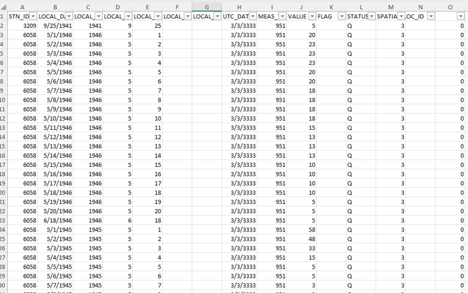

# QC Machine Learning


## Purpose
This project is intended to be an introduction of machine learning into the QC process, not to replace it, but to aid in the initial filtering of the summer snow on ground erroneous values. 

## Background
### Manual Process of SOG QC
1. A excel spreadsheet of the summer SOG was given, which included the STN_ID, LOCAL_DATE, LOCAL_YEAR, LOCAL_MONTH, LOCAL_DAY, MEAS_TYPE_ID, VALUE, and some other metadata

2. To make it easier on the eyes, the summer months were split into different pivot charts that displayed the station id, the meas type id, year, month, and day.


3. For each station, the STN_ID was used to find the name of the station and it's climate id.


4. The station was then looked up on CDO (https://climate.weather.gc.ca/historical_data/search_historic_data_e.html) where daily and hourly data could be found.

 

5. Some consideraions to look at to determine if the value in the spreadsheet was correct or not:
- [ ] Temperature: If the temperature was high above 0°C, then it was unlikely that there was any SOG in the summer months.
- [ ]  Total Precipitation, Total Snow, and Total Rain: If there was snow, then it is more likely that there was SOG. If there was high amounts of rain, that would likely wash away the snow on the ground.
- [ ] Snow on Ground: Finding a trend in the surrounding days. In the months of May and June, snow on ground would likely gradually decrease over time as the temperatures are rising. Consequently, in September, snow on gound would likely gradually increase over time as the temperatures are falling. If there are consecutive days with this kind of pattern, it is likely that the SOG reading is accurate (and not measuring grass or some other element).
- [ ] Hourly Weather: If there was any kind of snow or hail, then the chance that there was snow on ground increased. Sometimes it would snow in the early or late hours of the day, which could explain for SOG when the mean temperature is not below 0°C.

### Automatic Process (using Python)
1. The user will set up the program and the virtual environment as described below.
2. IMPORTANT: Generate.py has code to grab data from ARKEON, create the Machine Learning Models, and generate predictions based on the Machine Learning Models. Make sure the user comments out the correct portion of the code to ensure that it does what it needs to.
3. The user would log into their ARKEON account using their credentials
4. The program will read the excel spreadsheet of the summer SOG provided by the user, which includes the STN_ID, LOCAL_DATE, LOCAL_YEAR, LOCAL_MONTH, LOCAL_DAY, MEAS_TYPE_ID, VALUE, and some other metadata
- [ ] This file must be in the folder with all the python files and specifically witten in the Generate.py line 16 file so it reads the right excel spreadsheet.
```
16 excel_file_path = os.path.abspath("{name of xlsx}") 
17 excel_sheet = "Sheet1"
```
- [ ] The excel spreadsheet should look something like this: 

5. Filling the data from ARKEON
- [ ] There will be a for loop that goes through each row of the spreadsheet (each value that needs to be determined if it is correct) that takes the STN_ID, LOCAL_YEAR, LOCAL_MONTH, LOCAL_DAY, and MEAS_TYPE_ID to run a ARKEON database query using oracledb
```
SELECT 
    *
FROM
    archive.obs_data  
WHERE
    STN_ID = :id AND
    LOCAL_YEAR = :yr AND
    LOCAL_MONTH = :mo AND
    LOCAL_DAY = :day AND 
    MEAS_TYPE_ID = :meas
```
- [ ] From this query, the program will find daily (Max Temp, Min Temp, Mean Temp, Total Rain, Total Snow, Total Precipitation, Snow on Grnd -1, Snow on Grnd -2, Snow on Grnd -3, Snow on Grnd +1, Snow on Grnd +2, Snow on Grnd +3) and hourly information (Drizzle, Rain, Freezing Rain, Snow, Snow Grains, Ice Pellets, Rain Showers, Snow Showers, Hail, Blowing Snow, Thunderstorm, Snow Pellet, Ice Pellet Showers) using the elements respective MEAS_TYPE_IDs.
- [ ] **NEW** A new column will display the nearby station's sog. Using the euclidian distance (calculated using latitude, longitude, and elevation), if the nearby station is within a given radius it will be compared to other nearby stations to provide data of the two closest nearby stations. The max radius will be 5km in the south, 10km middle latitude of the country, and 20km in the north (progressively larger distance as you move south to north).
- [ ] The values will then be written back to the excel spreadsheet besides all the metadata that was fed into the program


6. Test and Train the Model
- [ ] The program will clean up the data so that the input columns will just be the ones that are relevant to verifying the SOG (ex. STN_ID will be temporarlily removed when fed into the program to create the model)
- [ ] The accurate column (which might be better named as Correct) are filled with the manual values.
    - [ ] In this case, I had already manually gone through the Phase 3 data, and I used a helper program found in Accurate.py to help me match up my findings with the spreadsheet that had each of the metadata for each value.
- [ ] The program makes use of the libraries from sklearn RandomForestClassifier
- [ ] The whole excel spreadsheet is divided 70% for training and 30% for testing
- [ ] The way that this RandomForestClassifier works is that it creates subsets of the training data.
- [ ] Each value is compared to the subsets of the training data to see if the comination of all the input values is similar to one in the training data. It will then look at the accuracy of the similar training data to determine if it thinks this value is correct or not. As it does this for many subsets of the training data, it takes the average of all the decisions for this one value to output whether the given value is correct or not.
- [ ] Accuracy and Precision are also calculated since the testing data have manual values for accuracy, and the program can compare it's predictions for the testing data to that.
- [ ] This model for comparing data is then saved to a joblib file that can be utilized for future data sets.
7. Using an Existing Model to Predict data
- [ ] Filling the data from ARKEON should be completed
- [ ] The program will clean up the data so that the input columns will just be the ones that are relevant to verifying the SOG (ex. STN_ID will be temporarlily removed when fed into the program to create the model)
- [ ] The accuracy column will be blank, as the predictions have not been made and there is no manual values.
- [ ] Similar to the test, train data, each row will be compared to the model to determine whether the SOG value is correct based on the patterns it saw when creating the model. 
- [ ] The prediction will be filled in the Accuracy column and saved in the excel file.

## Set Up
### Requirements

- [ ] PortableGit (or Git) installed
    - [ ] To install Git, go to https://git-scm.com/download/win The portable "thumbdrive edition", 64-bit, should not require administrative privileges, it should run directly without requiring installation. If you need to add it to your PATH, open the start menu and type without quotes "edit environment variables for your account", in the window that opens select PATH in the top half of the window (user variables, not system variables), click Edit, click New, and enter the path to the folder containing the Git executable.
- [ ] MUST be on VPN


### Files Included
- [ ] Generate
    - [ ] Generates data query, model building, and predictions
- [ ] Query
    - [ ] Handles all the data query from ARKEON
- [ ] Add Elements
    - [ ] Uses Query to get the data based on station, year, month, date, meas given
- [ ] Model
    - [ ] Handles everything that relates to the machine learning model
- [ ] Other: Accuracy
    - [ ] Pulled information from the phase 3 pivot tables
- [ ] requirements.txt
    - [ ] The library requirements to be imported
- [ ] SOG_model_x.joblib
    - [ ] These are the different models that can be imported to make predictions
- [ ] Excel files
    - [ ] Examples of Phase 3 and Phase 4&5
- [ ] SOG_Analysis
    - [ ] The analysis of the different models

### Clone and Configure (using Git)

- [ ] Navigate to your PortableGit folder
- [ ] Double click git-cmd.exe: 
- [ ] Type the following into the terminal
```
>>> git clone https://gccode.ssc-spc.gc.ca/harschnena/qc-machine-learning
```

### Create venv

- [ ] Still in the terminal, type the following:
```
>>> cd qc-machine-learning
>>> py -3 -m venv venv
>>> cd venv
>>> cd Scripts
>>> activate.bat
>>> # install all the libraries from requirements.txt
>>> pip install -r requirements.txt

```
- [ ] You can make use of pip freeze to see what libraries you have installed in your virtual environment to confirm installation.

```
>>> pip freeze
```

### How to Run
- [ ] You can verify that the virtual environment is running by seeing "({name of the venv})" in front of your command line
- [ ] If it is not there, follow these steps:
```
>>> cd qc-machine-learning 
>>> cd {name of the venv}
>>> cd Scripts
>>> activate.bat
```
- [ ] Once the venv is activated, follow these steps to run the model:
```
>>> cd ..
>>> cd ..
>>> py Generate.py
```

### Future Uses
For the future, you do not need to open git-cmd.exe, and instead can just open the terminal by typing "cmd" into the Windows Explorer.
Then follow how to run.


